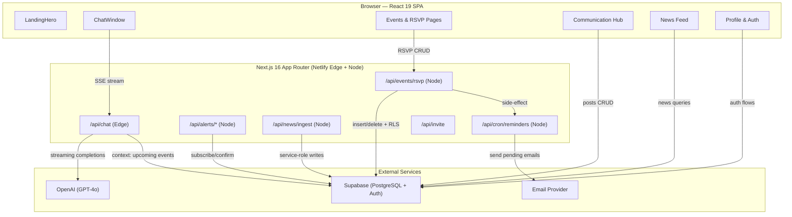
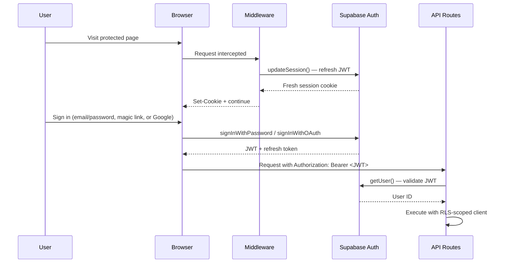
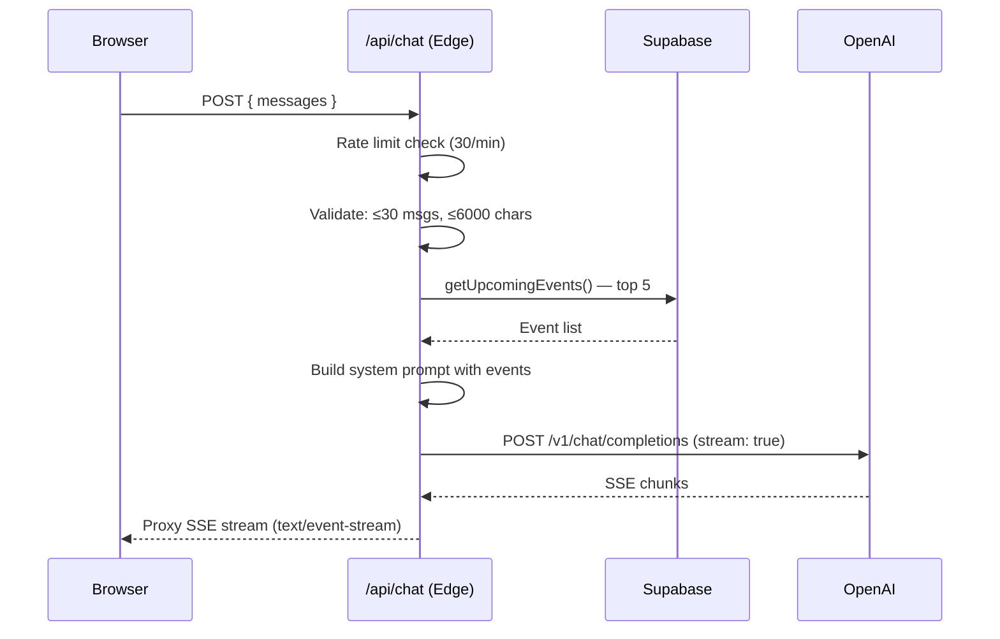
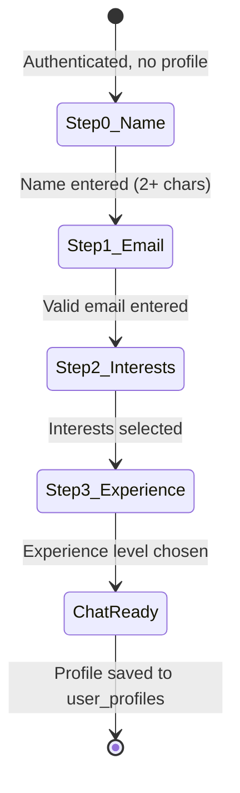
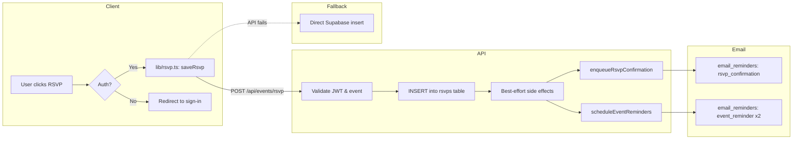

# Architecture — Gay-I Club Concierge

> **Version**: 2026-05-09  
> **Stack**: Next.js 16 (App Router) · React 19 · TypeScript · Supabase · OpenAI · Tailwind CSS v4  
> **Deployment**: Netlify (via `@netlify/plugin-nextjs`)  
> **Production**: [gayiclub.com](https://gayiclub.com) · Repo: [Guatapickl/gay-i-concierge](https://github.com/Guatapickl/gay-i-concierge)

---

## Table of Contents

1. [System Overview](#system-overview)
2. [Technology Stack](#technology-stack)
3. [Directory Layout](#directory-layout)
4. [Authentication & Authorization](#authentication--authorization)
5. [API Reference](#api-reference)
   - [Chat API](#chat-api)
   - [Event RSVP API (Full CRUD)](#event-rsvp-api-full-crud)
   - [Legacy RSVP API](#legacy-rsvp-api)
   - [Alerts API](#alerts-api)
   - [Other APIs](#other-apis)
6. [Club Concierge Chatbot](#club-concierge-chatbot)
   - [Backend (SSE Streaming)](#backend-sse-streaming)
   - [Frontend (ChatWindow)](#frontend-chatwindow)
   - [Onboarding Flow](#onboarding-flow)
7. [Event Management Pipeline](#event-management-pipeline)
   - [RSVP Lifecycle](#rsvp-lifecycle)
   - [Recurring Events](#recurring-events)
   - [Email Reminders](#email-reminders)
8. [Database Schema Summary](#database-schema-summary)
9. [Deployment & Infrastructure](#deployment--infrastructure)
10. [Design System](#design-system)

---

## System Overview



---

## Technology Stack

| Layer | Technology | Notes |
|-------|-----------|-------|
| **Framework** | Next.js 16 (App Router, Turbopack) | `next dev --turbopack` for local dev |
| **UI** | React 19, TypeScript 5 | Server & Client Components |
| **Styling** | Tailwind CSS v4 | Tokens in `app/globals.css`; postcss pipeline |
| **Fonts** | Space Grotesk (body), JetBrains Mono (code) | Via `next/font/google` |
| **Animations** | Framer Motion 11, tsparticles | Particle backgrounds + motion transitions |
| **Icons** | Lucide React | Tree-shakeable icon set |
| **Database** | Supabase (PostgreSQL) | RLS-enforced, UUID PKs |
| **Auth** | Supabase Auth | Email/password, magic link, Google OAuth |
| **AI** | OpenAI GPT-4o | Streaming chat completions |
| **Hosting** | Netlify | `@netlify/plugin-nextjs` auto-applied |
| **Email** | Server-side queue + provider | Via `lib/email.ts` |

---

## Directory Layout

```
gay-i-concierge/
├── app/                        # Next.js App Router pages & API routes
│   ├── api/
│   │   ├── chat/route.ts           # AI chatbot (Edge, SSE streaming)
│   │   ├── events/rsvp/route.ts    # Full RSVP CRUD (GET/POST/DELETE)
│   │   ├── rsvp/route.ts           # Legacy RSVP (POST-only, same DB)
│   │   ├── alerts/                 # subscribe, unsubscribe, confirm
│   │   ├── agenda/draft/route.ts   # AI agenda generation
│   │   ├── cron/reminders/route.ts # Email reminder processor
│   │   ├── invite/route.ts         # Invite link generator
│   │   ├── news/ingest/route.ts    # AI news ingestion pipeline
│   │   └── robot/generate/route.ts # Robot avatar generator
│   ├── auth/                   # Sign-in, sign-up, forgot, reset, callback
│   ├── events/                 # Event listing, detail, edit, new
│   ├── chat/page.tsx           # Full-page chat
│   ├── hub/page.tsx            # Communication Hub
│   ├── feed/page.tsx           # Social feed
│   ├── news/page.tsx           # AI-curated news
│   ├── calendar/page.tsx       # Calendar view
│   ├── community/page.tsx      # Community directory
│   ├── profile/page.tsx        # User profile management
│   ├── resources/              # Resource library CRUD
│   ├── robot/page.tsx          # AI robot benchmark page
│   ├── layout.tsx              # Root layout (fonts, AppLayout wrapper)
│   ├── page.tsx                # Landing page
│   └── globals.css             # Design tokens (Tailwind v4)
├── components/
│   ├── AppLayout.tsx           # Authenticated shell (nav, chat modal)
│   ├── ChatWindow.tsx          # Chatbot UI + onboarding flow
│   ├── ChatModalProvider.tsx   # Global floating chat modal
│   ├── DashboardView.tsx       # Member dashboard
│   ├── LandingHero.tsx         # Landing page hero
│   ├── MyRsvps.tsx             # User's RSVP list
│   ├── EventListItem.tsx       # Event card component
│   ├── feed/                   # PostCard, PostComposer
│   ├── robots/                 # AI robot avatar components
│   └── ui/                     # Shared: Button, Alert, FormField, etc.
├── lib/
│   ├── supabase.ts             # Browser Supabase client
│   ├── supabaseAdmin.ts        # Service-role client (server-only)
│   ├── events.ts               # Event CRUD + series operations
│   ├── rsvp.ts                 # RSVP save/delete/check (API + fallback)
│   ├── recurrence.ts           # Recurring event row generation
│   ├── reminders.ts            # Email reminder queue management
│   ├── posts.ts                # Newsfeed CRUD
│   ├── news.ts                 # News item queries
│   ├── resources.ts            # Resource library CRUD
│   ├── profile.ts              # Profile upsert/fetch
│   ├── interests.ts            # Interest catalog queries
│   ├── calendar.ts             # iCal/Google Calendar export
│   ├── email.ts                # Email sending abstraction
│   ├── emailTemplates.ts       # HTML email templates
│   ├── openai.ts               # OpenAI client wrapper
│   ├── rateLimit.ts            # In-memory rate limiter
│   ├── robotProviders.ts       # AI model provider registry
│   └── tokens.ts               # Token generation utilities
├── types/supabase.ts           # TypeScript types mirroring DB schema
├── utils/supabase/             # SSR middleware helpers
├── netlify/functions/          # Netlify scheduled functions
├── middleware.ts               # Supabase session refresh middleware
├── docs/
│   ├── architecture.md         # ← This document
│   └── database-schema.md      # Full database schema reference
└── tests/                      # Vitest unit tests
```

---

## Authentication & Authorization

### Auth Flow



### Authorization Tiers

| Tier | Mechanism | Used By |
|------|-----------|---------|
| **Anonymous** | Supabase `anon` key | Public event listing, news reads |
| **Authenticated** | JWT from `auth.getUser()` | RSVPs, chat, profile, posts |
| **Admin** | `is_admin()` SQL function checks `app_admins` table | Event CRUD, announcements, pins |
| **Service Role** | `SUPABASE_SERVICE_ROLE_KEY` (server-only) | Alerts, email queue, news ingestion |

### Middleware

The root `middleware.ts` runs on every non-static request. It calls `updateSession()` to silently refresh Supabase auth cookies, keeping the user session alive across navigations.

```
Matcher: /((?!_next/static|_next/image|favicon.ico|.*\.(svg|png|jpg|jpeg|gif|webp)$).*)
```

---

## API Reference

### Chat API

**`POST /api/chat`** — AI concierge chat (SSE streaming)

| Property | Value |
|----------|-------|
| Runtime | `edge` |
| Auth | None (rate-limited by client IP) |
| Rate Limit | 30 requests / 60s per client |

**Request:**
```json
{
  "messages": [
    { "role": "user", "content": "What events are coming up?" }
  ]
}
```

**Response:** Server-Sent Events stream (OpenAI SSE format)

**Behavior:**
1. Validates message count (max 30) and total character length (max 6000)
2. Fetches top 5 upcoming events from Supabase to inject as system context
3. Prepends a system message with event recommendations when available
4. Proxies the streaming response directly from OpenAI GPT-4o
5. Returns `text/event-stream` with `Cache-Control: no-cache`

---

### Event RSVP API (Full CRUD)

**`/api/events/rsvp`** — Full RSVP management (Node.js runtime)

#### GET — Query RSVPs

| Param | Required | Description |
|-------|----------|-------------|
| `event_id` | Yes | Event UUID |
| `check` | No | If `"true"`, returns `{ rsvped: boolean }` for the authed user |

**Check mode** (authenticated):
```json
// GET /api/events/rsvp?event_id=...&check=true
// → 200
{ "rsvped": true }
```

**Attendee list** (public, RLS-scoped):
```json
// GET /api/events/rsvp?event_id=...
// → 200
{
  "event_id": "uuid",
  "count": 5,
  "attendees": [
    { "id": "uuid", "profile_id": "uuid", "name": "Alice", "rsvped_at": "2026-05-01T..." }
  ]
}
```

#### POST — Create RSVP

**Auth:** Bearer JWT required

```json
// POST /api/events/rsvp
// Body:
{ "event_id": "uuid" }
// → 200
{ "ok": true, "event_id": "uuid", "profile_id": "uuid" }
```

**Side effects (best-effort):**
- `enqueueRsvpConfirmation()` — queues an RSVP confirmation email
- `scheduleEventReminders()` — creates 24h and 1h reminder rows

#### DELETE — Cancel RSVP

**Auth:** Bearer JWT required

```json
// DELETE /api/events/rsvp?event_id=...
// → 200
{ "ok": true, "event_id": "uuid" }
```

---

### Legacy RSVP API

**`POST /api/rsvp`** — Original RSVP endpoint (POST-only)

Functionally identical to `POST /api/events/rsvp`. Both write to the same `rsvps` table and trigger the same email side effects. The `/api/events/rsvp` route supersedes this with full CRUD support.

---

### Alerts API

| Endpoint | Method | Description |
|----------|--------|-------------|
| `/api/alerts/subscribe` | POST | Subscribe to email/SMS alerts (rate limited) |
| `/api/alerts/unsubscribe` | POST | Unsubscribe from alerts |
| `/api/alerts/confirm` | GET | Consume double opt-in token |
| `/api/alerts/unsubscribe/confirm` | GET | Consume unsubscribe token |

All alerts routes use the service-role Supabase client server-side to bypass RLS.

---

### Other APIs

| Endpoint | Method | Runtime | Description |
|----------|--------|---------|-------------|
| `/api/agenda/draft` | POST | Node | AI-generated meeting agenda via OpenAI |
| `/api/cron/reminders` | POST/GET | Node | Processes pending `email_reminders` queue |
| `/api/invite` | POST | Edge | Generates short invite text for sharing |
| `/api/news/ingest` | POST | Node | Ingests AI-curated news articles |
| `/api/robot/generate` | POST | Node | Generates AI robot benchmark avatars |

---

## Club Concierge Chatbot

### Backend (SSE Streaming)



**Key design decisions:**
- **Edge runtime** for minimal latency — no cold start penalty
- **Event context injection** — upcoming events are fetched at request time and prepended as a system message so the chatbot can recommend relevant events
- **No auth required** — the chat route uses rate limiting instead to keep the chat accessible to visitors exploring the site

---

### Frontend (ChatWindow)

The `ChatWindow` component (`components/ChatWindow.tsx`) is a 687-line client component that handles:

1. **SSE stream parsing** — reads `ReadableStream` chunks, parses OpenAI `data:` lines, and renders tokens incrementally
2. **Request cancellation** — tracks an `AbortController` ref; new messages abort the prior in-flight request
3. **Markdown rendering** — a lightweight custom renderer handles bold, italic, code blocks, headers, and lists without a full markdown library dependency
4. **Suggestion chips** — four quick-action buttons ("What's next?", "Explain AI", "Club info", "Project ideas") that populate the input
5. **Auto-scroll** — the message area scrolls to bottom on new content, with a floating "scroll to bottom" FAB when the user scrolls up
6. **RSVP prompt integration** — after onboarding, checks for the next upcoming event and prompts the user to RSVP inline

**State management:** Component-local `useState` hooks — no external state library. Messages, input, loading, onboarding step, and RSVP state are all local.

**System prompt character "AIlex":**
- Persona: witty, inclusive, energetic AI club assistant
- Tone: warm, playful yet professional
- Uses markdown formatting for structured responses
- Trained on the club's identity as a queer AI exploration community in NYC

---

### Onboarding Flow

New users who are authenticated but haven't completed onboarding are walked through a 4-step wizard embedded in the ChatWindow:



| Step | Input | Validation |
|------|-------|------------|
| 0 — Name | Text input | ≥ 2 characters |
| 1 — Email | Text input | Regex email validation |
| 2 — Interests | Checkbox grid (from `interests` table) + freeform | Optional |
| 3 — Experience | Button grid: None / Beginner / Intermediate / Advanced | Required |

On completion, the profile is upserted to `user_profiles` with `full_name`, `email`, `experience_level`, and `interests[]`.

---

## Event Management Pipeline

### RSVP Lifecycle



**Client-side (`lib/rsvp.ts`)** provides five public functions:

| Function | Description |
|----------|-------------|
| `saveRsvp(profileId, eventId)` | Create RSVP via API, fallback to direct insert |
| `deleteRsvp(profileId, eventId)` | Cancel RSVP via API, fallback to direct delete |
| `getRsvpedEventIds(profileId)` | List event IDs the user has RSVPed for |
| `checkRsvpStatus(eventId)` | API call: has current user RSVPed? Returns `boolean \| null` |
| `getEventAttendees(eventId)` | Public: fetch attendee list with names |

**Idempotency:** The `POST` handler tolerates `duplicate key` Supabase errors, making repeated RSVP calls safe.

---

### Recurring Events

The system supports recurring meeting series using a "materialized instances" strategy:

- Each occurrence is a **concrete row** in the `events` table sharing a `series_id`
- `recurrence_rule` stores an RRULE-lite string (e.g. `FREQ=WEEKLY;INTERVAL=2;BYDAY=TU`)
- `lib/recurrence.ts` generates the individual rows from a `RecurrenceConfig`
- Series-wide edits target all rows with the same `series_id`

**Event CRUD (`lib/events.ts`):**

| Function | Description |
|----------|-------------|
| `getUpcomingEvents()` | All future events, sorted by date |
| `createEvent(event)` | Single event insert |
| `createRecurringSeries(args)` | Bulk-insert series via `buildSeriesRows()` |
| `updateEvent(id, updates)` | Update single instance |
| `deleteEvent(id)` / `deleteSeries(seriesId)` | Delete single or full series |
| `getEventById(id)` | Fetch by UUID |
| `getEventsByIds(ids)` | Batch fetch (used by "My RSVPs") |
| `getUpcomingSeriesEvents(seriesId)` | Next N instances in a series |

---

### Email Reminders

The `email_reminders` table acts as an async email queue:

1. **RSVP confirmation** — queued immediately on successful RSVP
2. **Event reminders** — 24h and 1h before event start
3. **Cron processor** — `/api/cron/reminders` picks up `status = 'pending'` rows where `send_at ≤ now()`
4. **Retry logic** — failed sends increment `attempts` and are retried on next cron run

---

## Database Schema Summary

Full schema documentation: [`docs/database-schema.md`](./database-schema.md)

### Tables at a Glance

| Domain | Tables |
|--------|--------|
| **Core** | `user_profiles`, `app_admins`, `interests` |
| **Events** | `events`, `rsvps` |
| **Newsfeed** | `posts`, `post_comments`, `post_reactions`, `chat_channels` |
| **News** | `news_items`, `news_saves` |
| **Alerts** | `alerts_subscribers`, `alerts_confirmations` |
| **Email** | `email_reminders` |
| **Resources** | `resources` |
| **Views** | `v_upcoming_events` (materialized upcoming + RSVP count) |

### Key Relationships

```
auth.users ─┬── user_profiles (1:1)
            ├── app_admins (1:1, optional)
            ├── rsvps (1:N)
            ├── posts (1:N)
            ├── post_comments (1:N)
            ├── post_reactions (1:N)
            ├── news_saves (1:N)
            ├── resources (1:N)
            ├── email_reminders (1:N)
            └── alerts_subscribers (1:1, optional)

events ─┬── rsvps (1:N)
        ├── posts (1:N, optional link)
        └── email_reminders (1:N)
```

### RLS Policy Summary

- **Public reads**: events, news_items (anyone can browse)
- **Self-service**: profiles, RSVPs, reactions (enforced by `auth.uid()`)
- **Admin-gated writes**: events, announcements, pins (via `is_admin()`)
- **Service-role only**: alerts, email queue, news ingestion (server-side bypass)

---

## Deployment & Infrastructure

### Netlify Configuration

```toml
[build]
  command = "npm run build"
  publish = ".next"

[functions]
  directory = "netlify/functions"
  node_bundler = "esbuild"

[build.environment]
  NODE_VERSION = "20"
```

The `@netlify/plugin-nextjs` plugin (auto-detected) handles:
- Mapping App Router pages and API routes to Netlify Functions / Edge Functions
- Static asset serving from `.next/static`
- ISR and SSR support

### Environment Variables

| Variable | Scope | Description |
|----------|-------|-------------|
| `OPENAI_API_KEY` | Server | OpenAI API key for chat and content generation |
| `NEXT_PUBLIC_SUPABASE_URL` | Public | Supabase project URL |
| `NEXT_PUBLIC_SUPABASE_ANON_KEY` | Public | Supabase anonymous API key |
| `SUPABASE_SERVICE_ROLE_KEY` | Server | Service-role key for admin operations |
| `NEXT_PUBLIC_SITE_URL` | Public | Production site URL (for metadata) |

### CI/CD Pipeline

```
npm run test → lint → typecheck → smoke tests → build
```

| Script | Purpose |
|--------|---------|
| `test:lint` | ESLint |
| `test:type` | `tsc --noEmit` |
| `test:smoke` | `scripts/smoke-tests.mjs` |
| `test:unit` | Vitest |
| `test:all` | Type + smoke + unit |
| `test` | Full pipeline: lint + type + smoke + build |

---

## Design System

The app uses a **cyberpunk-futuristic** aesthetic defined in `app/globals.css` with Tailwind v4 design tokens:

- **Fonts**: Space Grotesk (display/body), JetBrains Mono (code)
- **Animations**: Framer Motion for page transitions, tsparticles for ambient backgrounds
- **Components**: Shared UI kit in `components/ui/` (Button, Alert, FormField, FormInput, FormTextarea, LoadingSpinner)
- **Layout**: `AppLayout` wraps all pages with navigation, auth-aware header, mobile nav, and the global floating chat modal (`ChatModalProvider`)

> ⚠️ **Tailwind v4 note**: Tokens are defined inline in `globals.css`. Avoid using undefined utility names (e.g., `bg-primary` without a token definition). Use the defined design tokens or standard Tailwind utilities.
