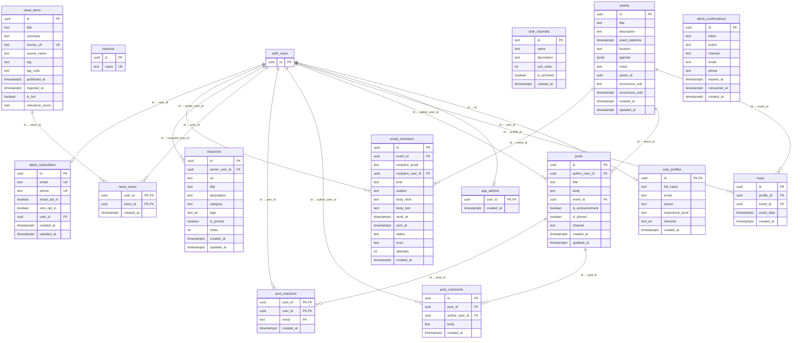

# Database Schema — Gay-I Club Concierge

> **Stack**: Supabase (PostgreSQL) · RLS-enforced · UUID primary keys  
> **Last updated**: 2026-05-01

---

## Table of Contents

1. [Entity-Relationship Diagram](#entity-relationship-diagram)
2. [Core Tables](#core-tables)
   - [user_profiles](#user_profiles)
   - [app_admins](#app_admins)
   - [interests](#interests)
3. [Event Management](#event-management)
   - [events](#events)
   - [rsvps](#rsvps)
4. [Newsfeed & Communication](#newsfeed--communication)
   - [posts](#posts)
   - [post_comments](#post_comments)
   - [post_reactions](#post_reactions)
   - [chat_channels](#chat_channels)
5. [News (AI-Curated)](#news-ai-curated)
   - [news_items](#news_items)
   - [news_saves](#news_saves)
6. [Alerts & Notifications](#alerts--notifications)
   - [alerts_subscribers](#alerts_subscribers)
   - [alerts_confirmations](#alerts_confirmations)
   - [email_reminders](#email_reminders)
7. [Resources](#resources)
   - [resources](#resources-table)
8. [Views](#views)
9. [RPC Functions](#rpc-functions)
10. [Row Level Security Summary](#row-level-security-summary)
11. [Indexes](#indexes)
12. [Migration File Reference](#migration-file-reference)

---

## Entity-Relationship Diagram



---

## Core Tables

### user_profiles

Member profiles coupled to Supabase Auth users. Created on first login or profile save.

| Column | Type | Constraints | Description |
|--------|------|-------------|-------------|
| `id` | `uuid` | **PK**, FK → `auth.users(id)` ON DELETE CASCADE | Auth user ID |
| `full_name` | `text` | nullable | Display name |
| `email` | `text` | nullable | Contact email |
| `phone` | `text` | nullable | Phone number |
| `experience_level` | `text` | CHECK (`none`, `beginner`, `intermediate`, `advanced`) | AI experience level |
| `interests` | `text[]` | default `'{}'` | Array of interest names |
| `created_at` | `timestamptz` | default `now()` | |

### app_admins

Lookup table for admin privileges. The `is_admin()` SQL function checks membership.

| Column | Type | Constraints | Description |
|--------|------|-------------|-------------|
| `user_id` | `uuid` | **PK**, FK → `auth.users(id)` ON DELETE CASCADE | Admin user |
| `created_at` | `timestamptz` | default `now()` | |

### interests

Catalog of selectable interest tags (used in profile onboarding).

| Column | Type | Constraints | Description |
|--------|------|-------------|-------------|
| `id` | `uuid` | **PK**, default `gen_random_uuid()` | |
| `name` | `text` | **UNIQUE**, NOT NULL | Interest name |

---

## Event Management

### events

Central table for club meetings. Supports both one-off events and recurring series.

| Column | Type | Constraints | Description |
|--------|------|-------------|-------------|
| `id` | `uuid` | **PK**, default `gen_random_uuid()` | |
| `title` | `text` | NOT NULL | Event title |
| `description` | `text` | nullable | Event description |
| `event_datetime` | `timestamptz` | NOT NULL | Start date/time |
| `location` | `text` | nullable | Venue / address |
| `agenda` | `jsonb` | nullable | Structured agenda (array of `AgendaItem`) |
| `notes` | `text` | nullable | Post-meeting recap (markdown) |
| `series_id` | `uuid` | nullable | Shared ID across recurring instances |
| `recurrence_rule` | `text` | nullable | RRULE-lite string (e.g. `FREQ=WEEKLY;INTERVAL=2;BYDAY=TU`) |
| `recurrence_until` | `timestamptz` | nullable | Series end date |
| `created_at` | `timestamptz` | default `now()` | |
| `updated_at` | `timestamptz` | default `now()`, auto-trigger | |

**Recurrence strategy**: Each occurrence is a concrete row sharing a `series_id`. The `recurrence_rule` is stored on every instance for display context. Per-instance edits stay local; series-wide edits target all rows matching `series_id`.

**AgendaItem JSON structure**:
```typescript
{
  time?: string | null;    // "10:00 AM"
  title: string;           // "Welcome & Introductions"
  speaker?: string | null;
  notes?: string | null;
}
```

### rsvps

Tracks member RSVPs to events. One RSVP per user per event (enforced by unique constraint).

| Column | Type | Constraints | Description |
|--------|------|-------------|-------------|
| `id` | `uuid` | **PK**, default `gen_random_uuid()` | |
| `profile_id` | `uuid` | NOT NULL, FK → `auth.users(id)` ON DELETE CASCADE | RSVP owner |
| `event_id` | `uuid` | NOT NULL, FK → `events(id)` ON DELETE CASCADE | Target event |
| `event_date` | `timestamptz` | nullable | Denormalized event date |
| `created_at` | `timestamptz` | default `now()` | |

**Unique constraint**: `(profile_id, event_id)` — prevents duplicate RSVPs.

**RSVP flow**: Client calls `POST /api/rsvp` with `event_id`. The API route validates the auth token, inserts the RSVP, and enqueues a confirmation email via `email_reminders`. Falls back to direct Supabase insert if the API is unavailable.

---

## Newsfeed & Communication

### posts

Member-authored content — announcements, recaps, general discussion, and communication hub messages.

| Column | Type | Constraints | Description |
|--------|------|-------------|-------------|
| `id` | `uuid` | **PK**, default `gen_random_uuid()` | |
| `author_user_id` | `uuid` | NOT NULL, FK → `auth.users(id)` ON DELETE CASCADE | Author |
| `title` | `text` | nullable | Post title |
| `body` | `text` | NOT NULL | Post body text |
| `event_id` | `uuid` | FK → `events(id)` ON DELETE SET NULL | Optional linked event |
| `is_announcement` | `boolean` | NOT NULL, default `false` | Admin-only flag |
| `is_pinned` | `boolean` | NOT NULL, default `false` | Admin-only flag |
| `channel` | `text` | nullable | Communication Hub channel (e.g. `general`, `events`) |
| `created_at` | `timestamptz` | default `now()` | |
| `updated_at` | `timestamptz` | default `now()`, auto-trigger | |

### post_comments

Threaded comments on posts.

| Column | Type | Constraints | Description |
|--------|------|-------------|-------------|
| `id` | `uuid` | **PK**, default `gen_random_uuid()` | |
| `post_id` | `uuid` | NOT NULL, FK → `posts(id)` ON DELETE CASCADE | Parent post |
| `author_user_id` | `uuid` | NOT NULL, FK → `auth.users(id)` ON DELETE CASCADE | Author |
| `body` | `text` | NOT NULL | Comment body |
| `created_at` | `timestamptz` | default `now()` | |

### post_reactions

Emoji reactions on posts. Composite PK prevents duplicate reactions per user per emoji.

| Column | Type | Constraints | Description |
|--------|------|-------------|-------------|
| `post_id` | `uuid` | **PK**, FK → `posts(id)` ON DELETE CASCADE | |
| `user_id` | `uuid` | **PK**, FK → `auth.users(id)` ON DELETE CASCADE | |
| `emoji` | `text` | **PK**, NOT NULL | Emoji character |
| `created_at` | `timestamptz` | default `now()` | |

### chat_channels

Canonical channel list for the Communication Hub. Posts reference `channel` as free text.

| Column | Type | Constraints | Description |
|--------|------|-------------|-------------|
| `id` | `text` | **PK** | Channel slug (e.g. `general`) |
| `name` | `text` | NOT NULL | Display name (e.g. `# general`) |
| `description` | `text` | nullable | Channel description |
| `sort_order` | `int` | NOT NULL, default `0` | UI ordering |
| `is_archived` | `boolean` | NOT NULL, default `false` | |
| `created_at` | `timestamptz` | default `now()` | |

**Seeded channels**: `general`, `models` (model-releases), `events`, `papers` (paper-club), `random` (off-topic).

---

## News (AI-Curated)

### news_items

AI-summarized articles ingested by The Cortex sensorium pipeline. Public reads, service-role writes only.

| Column | Type | Constraints | Description |
|--------|------|-------------|-------------|
| `id` | `uuid` | **PK**, default `gen_random_uuid()` | |
| `title` | `text` | NOT NULL | Article title |
| `summary` | `text` | NOT NULL | AI-generated summary |
| `source_url` | `text` | NOT NULL, **UNIQUE** | Original article URL |
| `source_name` | `text` | nullable | Publisher name |
| `tag` | `text` | nullable | Category tag (e.g. `Model Release`, `Research`, `Safety`) |
| `tag_color` | `text` | nullable | Hex color for UI badge |
| `published_at` | `timestamptz` | nullable | Original publish date |
| `ingested_at` | `timestamptz` | default `now()` | |
| `is_hot` | `boolean` | NOT NULL, default `false` | Trending flag |
| `relevance_score` | `real` | nullable | 0..1 relevance from Cortex |

### news_saves

Bookmarked news items per member.

| Column | Type | Constraints | Description |
|--------|------|-------------|-------------|
| `user_id` | `uuid` | **PK**, FK → `auth.users(id)` ON DELETE CASCADE | |
| `news_id` | `uuid` | **PK**, FK → `news_items(id)` ON DELETE CASCADE | |
| `created_at` | `timestamptz` | default `now()` | |

---

## Alerts & Notifications

### alerts_subscribers

Email/SMS opt-in registry. Supports both anonymous and authenticated subscribers.

| Column | Type | Constraints | Description |
|--------|------|-------------|-------------|
| `id` | `uuid` | **PK**, default `gen_random_uuid()` | |
| `email` | `text` | **UNIQUE**, nullable | |
| `phone` | `text` | **UNIQUE**, nullable | |
| `email_opt_in` | `boolean` | NOT NULL, default `false` | |
| `sms_opt_in` | `boolean` | NOT NULL, default `false` | |
| `user_id` | `uuid` | FK → `auth.users(id)` ON DELETE SET NULL | Optional link to auth user |
| `email_opt_in_at` | `timestamptz` | nullable | Consent audit trail |
| `email_opt_out_at` | `timestamptz` | nullable | |
| `sms_opt_in_at` | `timestamptz` | nullable | |
| `sms_opt_out_at` | `timestamptz` | nullable | |
| `consent_source` | `text` | nullable | e.g. `web_form`, `api` |
| `consent_ip` | `inet` | nullable | Requester IP |
| `created_at` | `timestamptz` | default `now()` | |
| `updated_at` | `timestamptz` | default `now()`, auto-trigger | |

### alerts_confirmations

Double opt-in/out tokens for email and SMS subscriptions.

| Column | Type | Constraints | Description |
|--------|------|-------------|-------------|
| `id` | `uuid` | **PK**, default `gen_random_uuid()` | |
| `token` | `text` | NOT NULL, indexed | Confirmation token |
| `action` | `text` | NOT NULL, CHECK (`subscribe`, `unsubscribe`) | |
| `channel` | `text` | NOT NULL, CHECK (`email`, `sms`) | |
| `email` | `text` | nullable | |
| `phone` | `text` | nullable | |
| `expires_at` | `timestamptz` | nullable | Token expiry |
| `consumed_at` | `timestamptz` | nullable | Set when token is used |
| `created_at` | `timestamptz` | default `now()` | |

### email_reminders

Server-side email queue processed by cron jobs. One row per scheduled send.

| Column | Type | Constraints | Description |
|--------|------|-------------|-------------|
| `id` | `uuid` | **PK**, default `gen_random_uuid()` | |
| `event_id` | `uuid` | FK → `events(id)` ON DELETE CASCADE | |
| `recipient_email` | `text` | NOT NULL | |
| `recipient_user_id` | `uuid` | FK → `auth.users(id)` ON DELETE SET NULL | |
| `kind` | `text` | NOT NULL, CHECK (see below) | Email type |
| `subject` | `text` | NOT NULL | |
| `body_html` | `text` | NOT NULL | |
| `body_text` | `text` | nullable | Plain text fallback |
| `send_at` | `timestamptz` | NOT NULL | Scheduled send time |
| `sent_at` | `timestamptz` | nullable | Actual send time |
| `status` | `text` | NOT NULL, default `pending`, CHECK | Processing state |
| `error` | `text` | nullable | Error message on failure |
| `attempts` | `int` | NOT NULL, default `0` | Retry counter |
| `created_at` | `timestamptz` | default `now()` | |

**Kind values**: `event_reminder`, `rsvp_confirmation`, `agenda_published`, `event_cancelled`, `digest`, `custom`

**Status values**: `pending`, `sending`, `sent`, `failed`, `skipped`

---

## Resources

### resources (table)

Shared resource library. Members can post links; admins can pin featured resources.

| Column | Type | Constraints | Description |
|--------|------|-------------|-------------|
| `id` | `uuid` | **PK**, default `gen_random_uuid()` | |
| `owner_user_id` | `uuid` | NOT NULL, FK → `auth.users(id)` ON DELETE CASCADE | Creator |
| `url` | `text` | NOT NULL | Resource URL |
| `title` | `text` | NOT NULL | |
| `description` | `text` | nullable | |
| `category` | `text` | nullable | Single category |
| `tags` | `text[]` | default `'{}'` | Tag list |
| `is_pinned` | `boolean` | NOT NULL, default `false` | Admin pin |
| `clicks` | `int` | NOT NULL, default `0` | Click counter |
| `created_at` | `timestamptz` | default `now()` | |
| `updated_at` | `timestamptz` | nullable | |

---

## Views

### v_upcoming_events

Pre-filtered view of future events with RSVP count. Used by the events page and dashboard.

```sql
CREATE OR REPLACE VIEW v_upcoming_events AS
SELECT
  e.id, e.title, e.description, e.event_datetime, e.location,
  e.agenda, e.notes, e.series_id, e.recurrence_rule,
  e.recurrence_until, e.created_at, e.updated_at,
  (SELECT count(*) FROM rsvps r WHERE r.event_id = e.id) AS rsvp_count
FROM events e
WHERE e.event_datetime >= now()
ORDER BY e.event_datetime ASC;
```

---

## RPC Functions

### `is_admin() → boolean`
Returns `true` if `auth.uid()` exists in `app_admins`. Used in RLS policies for admin-gated writes.

### `rpc_create_alert_token(action, channel, email?, phone?, ttl_hours?) → text`
Security-definer function. Creates a double-opt-in/out confirmation token. Returns the token string.

### `rpc_consume_alert_token(token) → boolean`
Security-definer function. Validates and consumes a confirmation token, toggling the subscriber's opt-in flag.

### `set_updated_at() → trigger`
Generic trigger function. Sets `NEW.updated_at = now()` on any UPDATE. Applied to: `alerts_subscribers`, `events`, `posts`.

---

## Row Level Security Summary

All tables have RLS enabled. Policies follow a tiered model:

| Table | SELECT | INSERT | UPDATE | DELETE |
|-------|--------|--------|--------|--------|
| `user_profiles` | Self only | Self only | Self only | — |
| `app_admins` | — | — | — | — |
| `interests` | Public | Admin only | — | — |
| `events` | Public | Admin only | Admin only | Admin only |
| `rsvps` | Self only | Self (future events only) | — | Self only |
| `posts` | Authenticated | Author (pin/announce = admin) | Author or admin | Author or admin |
| `post_comments` | Authenticated | Author only | Author or admin | Author or admin |
| `post_reactions` | Authenticated | Self only | — | Self only |
| `chat_channels` | Authenticated | Admin only | Admin only | Admin only |
| `news_items` | Public | Service role | Service role | Service role |
| `news_saves` | Self only | Self only | — | Self only |
| `alerts_subscribers` | Public (read) | Service role | Service role | — |
| `alerts_confirmations` | Public (read) | Service role | Service role | — |
| `email_reminders` | Self only | Service role | Service role | — |
| `resources` | Authenticated | Owner or admin | Owner or admin | Owner or admin |

**Key patterns**:
- **Admin gating**: `is_admin()` function checks `app_admins` table membership
- **Self-service**: RSVPs, profiles, reactions enforce `auth.uid()` match
- **Service role**: Alerts and email writes run server-side with the service role key to bypass RLS
- **Future-only RSVPs**: Insert policy checks `event_datetime >= now()` to prevent RSVPs to past events

---

## Indexes

| Table | Index | Columns | Notes |
|-------|-------|---------|-------|
| `events` | `events_series_id_idx` | `series_id` | Series lookups |
| `events` | `events_event_datetime_idx` | `event_datetime` | Date range queries |
| `posts` | `posts_created_at_idx` | `created_at DESC` | Feed ordering |
| `posts` | `posts_event_id_idx` | `event_id` | Event-linked posts |
| `posts` | `posts_channel_idx` | `channel, created_at DESC` | Channel filtering |
| `post_comments` | `post_comments_post_id_idx` | `post_id, created_at` | Comment threads |
| `post_reactions` | `post_reactions_post_id_idx` | `post_id` | Reaction aggregation |
| `news_items` | `news_items_published_at_idx` | `published_at DESC NULLS LAST` | Feed ordering |
| `news_items` | `news_items_tag_idx` | `tag` | Category filtering |
| `email_reminders` | `email_reminders_due_idx` | `status, send_at` WHERE `status = 'pending'` | Cron pickup |
| `email_reminders` | `email_reminders_event_id_idx` | `event_id` | Event-linked reminders |
| `alerts_confirmations` | `alerts_confirmations_token_idx` | `token` | Token lookups |

---

## Migration File Reference

The schema is built incrementally from these files, applied in order:

| Order | File | Contents |
|-------|------|----------|
| 1 | `Supabase Requirements.txt` | Baseline schema: `user_profiles`, `interests`, `events`, `rsvps`, `alerts_subscribers`, `alerts_confirmations`, `resources` |
| 2 | `Supabase Production.sql` | Production hardening: `app_admins`, `is_admin()`, admin-only RLS policies, consent metadata, security-definer RPCs |
| 3 | `Supabase Hub Upgrade.sql` | Feature additions: recurring meetings, `posts`, `post_comments`, `post_reactions`, `email_reminders`, `chat_channels`, `news_items`, `news_saves`, `v_upcoming_events` view |

**TypeScript types**: `types/supabase.ts` — mirrors all table schemas as exported TypeScript types.

**Helper libraries** (in `lib/`):
- `events.ts` — CRUD + series operations
- `rsvp.ts` — RSVP save/delete/list with API fallback
- `recurrence.ts` — Series row generation from recurrence config
- `reminders.ts` — Email reminder queue management
- `posts.ts` — Newsfeed CRUD + hydrated feed queries
- `news.ts` — News item queries
- `resources.ts` — Resource library CRUD
- `profile.ts` — Profile upsert/fetch
- `interests.ts` — Interest catalog queries
