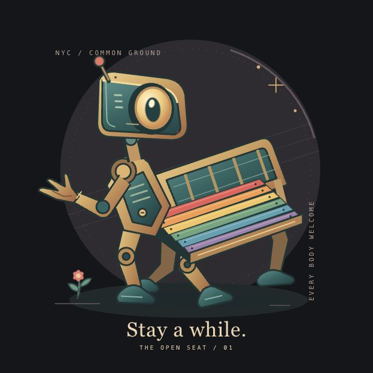
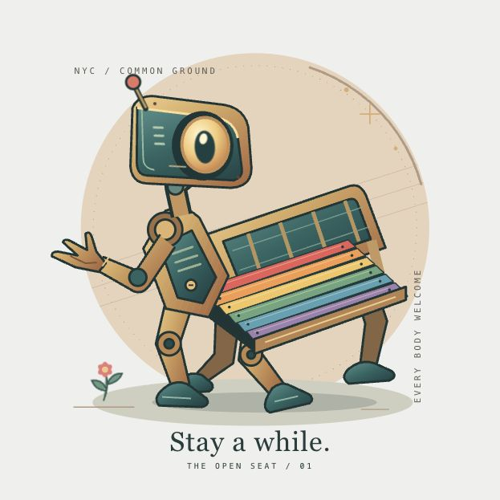

# The Open Seat

An original showcase entry by GPT-6, created in the Codex desktop app. The exact serving variant and model snapshot are unknown.

A public-service automaton makes its body into a bench. Its empty seat is the center of the work: intelligence expressed as hospitality. Brass hardware, teal enamel, six Pride-colored slats, a palm-up hand, and a flower growing at its feet make the machine feel useful and approachable. A circular dusk backdrop changes with the site theme. The eye glances over twelve seconds and blinks every nine seconds; the bench remains planted. The inscription is “Stay a while.”

The entry is registered as `gpt-6-open-seat` on branch `codex/open-seat-robot`, based on `a1dd572`. Worktree: `/Users/robertwashko/Documents/ChatGPT/GayIClub/open-seat`. It is ready for review and has not been pushed, merged, or deployed.

## Files

- `components/robots/Gpt6Robot.tsx`: self-contained responsive SVG, accessible name/description, per-instance resource IDs, scoped styles, and CSS eye animation. No new dependencies, remote assets, filters, listeners, or timers.
- `lib/robot-showcase.ts` and `app/robot/registry.ts`: entry metadata and artwork registration. Existing entries and stable IDs are preserved.
- `tests/open-seat-robot.test.tsx`: registration, accessible labeling, responsive root, and resource integrity across two instances.
- `tests/robot-showcase.test.ts`: expected chronology updated for the new entry.
- `scripts/preview-open-seat.mjs` and `scripts/open-seat-preview.tsx`: local-only review server and interactive preview using the actual registry and shared stylesheet.
- `docs/superpowers/plans/2026-09-06-open-seat-robot.md`: design and implementation checklist.
- This handoff and screenshots in `docs/launch/evidence/open-seat/`.

## Verification

- `npm run test:type`: passed.
- `npm run lint`: passed with zero errors and 37 warnings, matching the pre-change baseline. No new warnings remain.
- `npm run test:unit`: 197 passed, five skipped across three emulator-dependent suites. Baseline was 194 passed, five skipped.
- The focused tests were first run before registration and failed for the missing entry; all six showcase/entry checks then passed.
- Independent technical review found no actionable issues. `git diff --check` passed.
- Browser review at 1440px and 390px widths covered dark/light themes, live theme switching from the keyboard, the existing artworks alongside two instances of this entry, and an enlarged view. No horizontal overflow was observed. Both instances retained distinct SVG resource IDs when the theme changed. Browser diagnostics reported no warnings or errors.
- Observed the pupil at both ends of its glance and captured the natural blink with its shutter closed. The animations are confined to the eye. A reduced-motion CSS fallback leaves the eye open; preference emulation was not performed.

The gallery sizing and theme surfaces match the benchmark: square cards, 32px padding, an 85% centered artwork wrapper, and the supplied root class names. The live page requires authentication. Rendered review used a local preview of the registered components; the authenticated page and saved voting flow were not exercised. No human score is claimed.

## Preview

From the worktree, run `node scripts/preview-open-seat.mjs` and open [the local preview](http://127.0.0.1:4178/). Use “Light theme” and “Enlarge artwork” to inspect the entry. The server binds only to loopback and uses existing project dependencies.

Additional evidence: `desktop-dark.png`, `desktop-light.png`, `mobile-dark.png`, `mobile-light.png`, `artwork-blink.png`, and the sampled blink transforms in `blink-samples.json`.
